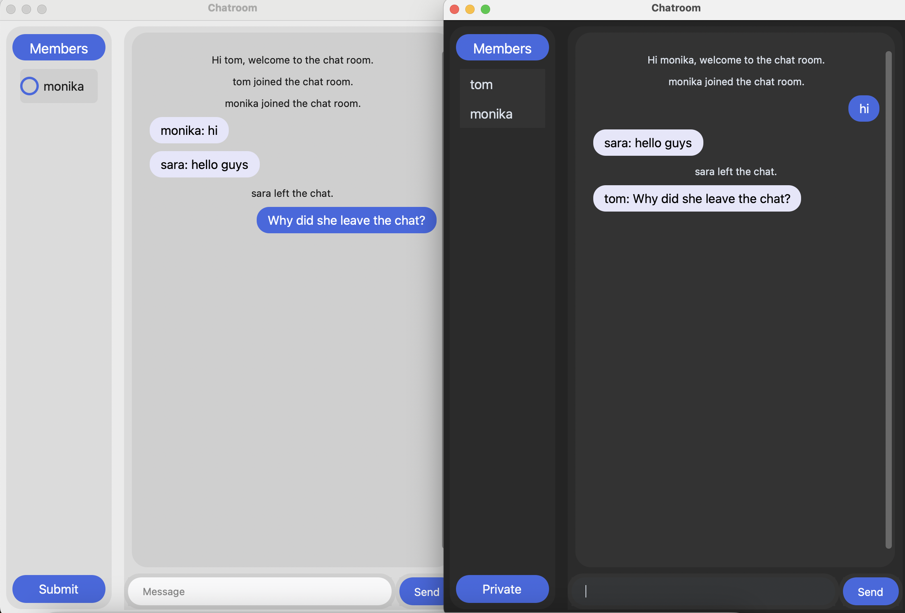

# TCP Chatroom

A simple TCP-based chat application with a modern GUI built using Python. The application supports both group and private messaging functionality.

## Features

- Real-time group chat
- Private messaging support
- Modern GUI using CustomTkinter
- Light/dark mode toggle
- Member list display
- Secure socket-based communication

## Requirements

- Python 3.x
- CustomTkinter
- socket (built-in)
- threading (built-in)

### Chat Commands

- Type `dark` or `light` to switch between dark and light themes
- Type `bye` to exit the chat

### Private Messaging

1. Click the "Private" button on the left panel
2. Select the users you want to message
3. Click "Submit"
4. Type your message and send
